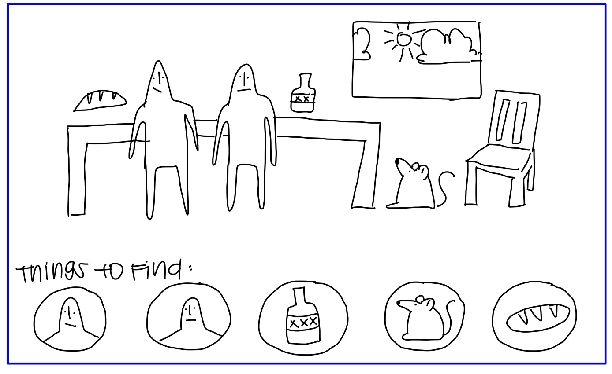
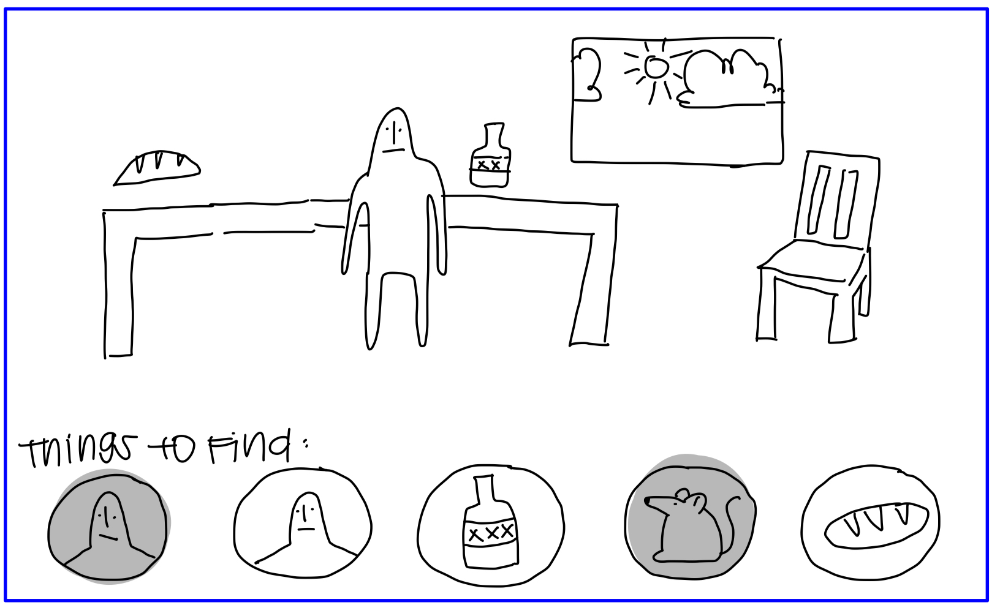
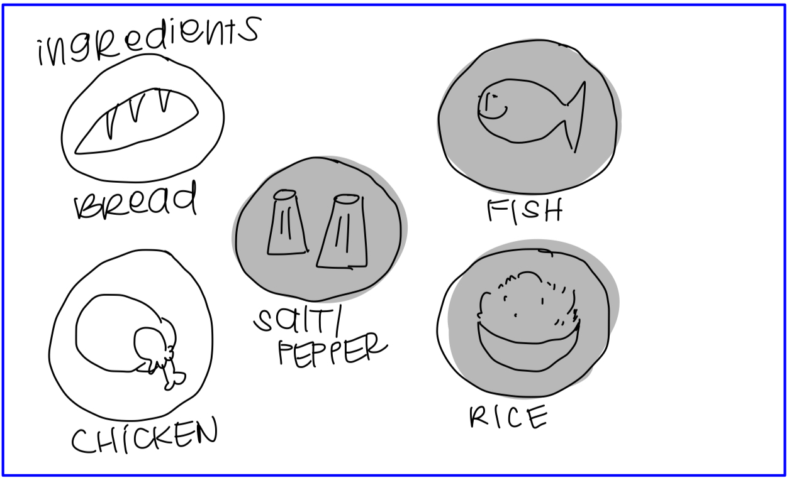
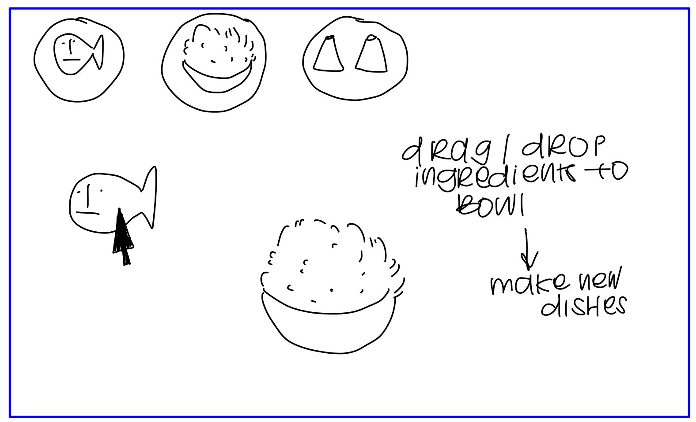
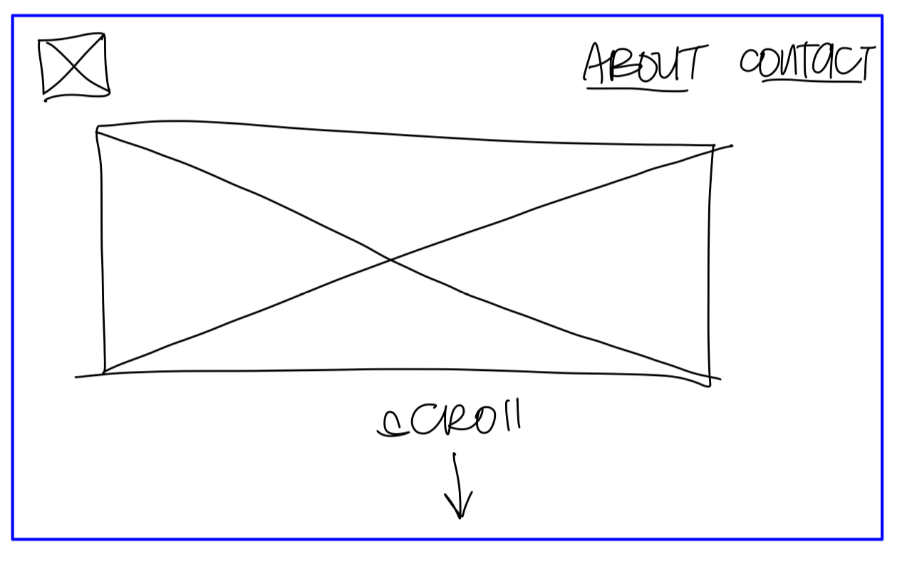

<mark>**Note that this document order from FP4 -> FP1**</mark>

<mark>Please sign up for the study</mark> at [https://tinyurl.com/pui-study](https://tinyurl.com/pui-study) to allow us to use your submission to create a better GenAI assistant for designers!

---

# **FP4 \- Final Project Writeup**

Feel free to refer to this [Markdown Cheat Sheet](https://www.markdownguide.org/cheat-sheet/) to make your writeup more organized, and you can preview your markdown file in VSCode [Markdown editing with Visual Studio Code](https://code.visualstudio.com/docs/languages/markdown#_markdown-preview). 

## Part 1: Website Description

Describe your website (300 words).

* What is the purpose of your website?   
* Who is the target audience?  
* What information do you convey with your website?   
* How is it interesting and engaging? 

## Part 2: User Interaction

How a user would interact with your website? For each step, briefly but clearly state the interaction type & how we should reproduce it.

1. Interaction type. Click on X on page Y / scroll on page X, etc.  
2. 

## Part 3: External Tool

Describe what important external tool you used (JavaScript library, Web API, animations, or other). Following the bulleted list format below, reply to each of the prompts.

1. Name of tool1  
   * Why did you choose to use it over other alternatives? (2 sentences max)  
   * How you used it? (2 sentences max)  
   * What does it add to your website? (2 sentences max)  
2. Name of tool2

## Part 4: Design Iteration

Describe how you iterated on your prototypes, if at all, including any changes you made to your original design while you were implementing your website and the rationale for the changes. (4-8 sentences max)

## Part 5: Implementation Challenge

What challenges did you experience in implementing your website? (2-4 sentences max)

## Part 6: Generative AI Use and Reflection

Describe how you used Generative AI tools to create this final project (fill in the following information, write \~500 words in total).

Document your use of all GenAI tools — ChatGPT, Copilot, Claude, Cursor, etc. using the template below. Add/Delete rows or bullet points if needed, and replace Tool1/Tool2 with the name of the tool.

### Usage Experiences by Project Aspects

Feel free to edit the column \_ (other?) or add more columns if there's any other aspect in your project you've used the GenAI tools for.

For the following aspects of your project, edit the corresponding table cell to answer:
- *Usage*: Whether you used / did not use this tool for the aspect. Enter [Yes/No]
- *Productivity*: Give a rating on whether this tool makes your productivity for X aspect [1-Much Reduced, 2-Reduced, 3-Slightly Reduced, 4-Not Reduced nor Improved, 5-Slightly Improved, 6-Improved, 7-Much Improved].

| Tool Name | Ratings | design | plan | write code | debug | \_ (other?) |
| :---- | :---- | :---- | :---- | :---- | :---- | :---- |
| Tool1 | Usage | Yes/No | Yes/No | Yes/No | Yes/No | Yes/No |
| Tool1 | Productivity | 1~7 | 1~7 | 1~7 | 1~7 | 1~7 |
| Tool2| Usage | Yes/No | Yes/No | Yes/No | Yes/No | Yes/No |
| Tool2 | Productivity | 1~7 | 1~7 | 1~7 | 1~7 | 1~7 |

### Usage Reflection

> Impact on your design and plan 
* It matched my expectations and plan in [FP2](#generative-ai-use-plan) in that … For example, 
  1. Tool1: 
  2. Tool2:
* It did not match my expectations and plan in [FP2](#generative-ai-use-plan) in that … For example, 
  1. Tool1: 
  2. Tool2:
* GenAI tool did/did not influence my final design and implementation plan because … For example, 
  1. Tool1: 
  2. Tool2:

> Use patterns
* I accepted the generations when …  For example, 
  1. Tool1: this tool once suggested … and I adjusted my design according to the suggestion because … 
  2. Tool2: 
* I critiqued/evaluated the generated suggestions by … For example, 
  1. Tool1: this tool once suggested … but I modified/rejected the suggestion because … 
  2. Tool2: 

> Pros and cons of using GenAI tools
* Pros
  1. Tool1: 
  2. Tool2:
* Cons
  1. Tool1: 
  2. Tool2:

### Usage Log

Document the usage logs (prompts and chat history links) for the GenAI tools you used. Some tools may not have an easy way to share usage logs, just try your best! Some instructions for different tools:

1. [ChatGPT](https://help.openai.com/en/articles/7925741-chatgpt-shared-links-faq) / [Gemini](https://support.google.com/gemini/answer/13743730?hl=en&co=GENIE.Platform%3DDesktop): share the anonymous link to all of your chat histories relevant to this project
2. [GitHub Copilot (VSCode)](https://code.visualstudio.com/docs/copilot/copilot-chat#:~:text=You%20can%20export%20all%20prompts%20and%20responses%20for%20a%20chat%20session%20in%20a%20JSON%20file%20with%20the%20Chat%3A%20Export%20Session...%20command%20(workbench.action.chat.export)%20in%20the%20Command%20Palette.): export chat histories relevant to this project.

---

# **FP3 \- Final Project Check-in**

Document the changes and progress of your project. How have you followed or changed your implementation & GenAI use plan and why? Remember to commit your code to save your progress.

## Implementation Plan Updates

- [ ] ...

## Generative AI Use Plan Updates

- [ ] ...

Remember to keep track of your prompts and usage for [FP4 writeup](#part-6-generative-ai-use-and-reflection).

---

# **FP2 \- Evaluation of the Final project**

## Project Description

Briefly restate your motivation and a short description of your project.

## High-Fi Prototypes

### *Prototype 1*

This is the home page and the work page of my personal site, the feedback I got from peers was mostly about my color contrast. The colors I used were too pale and the contrast was too light, making it hard for users to diffrentiate between what was in the foreground versus the background. The lack in contrast also made my work section confusing, and without any visual feedback upon hovering or clicking, it made it difficult for users to navigate the webpage upon testing. 

### *Prototype 2 UPDATED DESIGNS* 

…

## Usability Test
I changed my color scheme (inverted it) so that There would be a heavier contrast between my text and the background. I also accounted for my work section, which initially looked very confusing because it was hard to see which parts were clickable. It was also difficult to read my text. I had focused too much on microinteractions when making my first prototype that I had neglected big picture accessibility, thus confusing users and making it hard for them to scan through my webpage. To make my webpage more visible, I opted to change the worksection back to white upon scroll, so the intro/landing page would be dark purple and when users scroll down to view my work, the background would turn white. I hadn't implemented this transition, rather, i created a different prototype of a white background versus a dark purple one and had users run through each prototype and tell me which one they prefered. They all liked the white background better. I was also advised to add a custom cursor, and some little icons that can be played with but doesnt distract from the overall site. 

## Updated Designs
(I put the updated designs under prototype 2). 
When running through my second design, users had a much easier time scanning through my work section when I had changed the background to white. I used think-aloud to conduct these tests, sharing my prototype with my users and asking them to perform three tasks while thinking aloud to me. Task 1 was to navigate to my about section from my home page. Task 2 was to navigate to my projects section, and task 3 was to navigate back to home. I did this with my original dark purple background for all pages, and another one with white background in my pages that were not the home page. Users reported that they had a much easier time navigating through the site with the white background, saying how it was easier to read large amounts of information when the background was not dark and distracting. 

## Feedback Summary

In lab, when I presented my design, I had fixated a lot on my cursor, and I asked them mostly what they think about my custom cursor. The feedback i got was to stop focusing on my cursor, and instead focus on the readability and accessibility of the rest of my site. The cursor I initially had used was monochromatic, and was very faint against my white background in my first prototype. My peers told me that the cursor was actually more distracting than it was helping, and instead told me to finalize my design before working on my cursor so that I could have a better grasp of what the cursor should look like in order to match the rest of the site and not make it hard to see/access. 

## Milestones

Outline weekly milestones to plan your expected implementation progress until the end of the semester (\~300 words). 

### *Implementation Plan*

- [ ] Week 9 Oct 28 \- Nov 1:
  - [X] FP1 due
  - [ ] ...
  
- [ ] Week 10 Nov 4 \- Nov 8:   
  - [ ] FP2 due

- [ ] Week 11 Nov 11 \- Nov 15:  
  - [ ] hard code all pages 
- [ ] Week 12 Nov 18 \- Nov 22:   
  - [ ] work on interactions/accessibility
- [ ] Week 13 Nov 25 \- Nov 29:  
  - [ ] Work on interactions 
  - [ ] Thanksgiving  
- [ ] Week 14 Dec 2 \- Dec 6:  
  - [ ] FP4 due 

### *Libraries and Other Components*

List the JS libraries and other components (if applicable) that you plan to use. 
* None yet, but definitely will list as I go! 

## Generative AI Use Plan

I currently have no plans on using Gen AI but I will definitely list my usages once I get started with implementation. 

### *Tool Use*

 What would you use? Edit the list given your plan. For each tool, explain briefly on what do you expect Generative AI to help you with and what might it not be able to help you with.

* ChatGPT  
  * I will use it for … because it can help me …  
  * I will not use it for … because it might not be able to help me with …   
* GitHub Copilot  
* ...

### *Responsible Use*

How would you use Generative AI responsibly? 

---

# **FP1 \- Proposal for Critique**

## Idea Sketches

### *Idea 1*

 Idea 1: Hidden Objects game 
This is a “wheres Waldo” type game where i will have a very complex scene (that I will draw) and have a menu bar of items that players need to find on the scene. Once a user finds an object, they will click on it, and the item will disappear and a confirmation will show up. Once the user finds all the objects in the scene, the game will proceed to the next level. 
Since this is a very visual game, I plan on making the menu items and instructions as simple as possible to reduce users’ cognitive load. The scene where users will need to find objects will be intentionally very very confusing and complex, and to offload this balance I will make the surrounding interactions very plain and simple, with only two CTAs: hints, and exit. There will be a menu on the bottom of the screen that shows the users progress (found items and not found items). 

### *Idea 2*

Idea 2: Cooking Game 
Main idea: I will have a bunch of ingredients (all of which I will be drawing myself) and users can select as many ingredients as they want, and once they press [Make], the site will take the selected ingredients and make it into a recipe while also detailing the steps and how to make them. 
I will include a screen reader that reads the ingredients on the screen along with the CTAs so that it can be accessible and easy to navigate. 
…

### *Idea 3*

Idea 3: Personal Profile
I want to make a personal profile that details my professional and creative work, with an interactive about me section 
I plan on making it interactive by putting in places where users can mouse over to reveal more Information. But i plan on keeping the interactions simple so as to not distract from the rest of my portfolio 
I plan on making my design accessible by not adding in too much text, it will be heavy on images and illustrations, and I will have alt text under all my images. I will also research into my color palette to make sure the colors are within ADA guidelines.
…

## Feedback Summary

Critiques during lab:
During the lab session, I received valuable critiques that helped shape my approach to my personal website and portfolio. One key suggestion was to think more deeply about how I want to express myself and my interests through the design and content of my site. For instance, in the "About Me" section, I was encouraged to provide more personal insight into my passions and experiences, and include more physical mediums instead of purely digital things.  For the interactive recipe guide I’m developing, the feedback focused on making it more engaging and fun. Since I am already gamifying cooking, suggestions included gamifying the cooking experience, drawing inspiration from games like Breath of the Wild and Cooking mama to create fixed but playful interactions, especially around ingredient selection. This would make the process more interactive and enjoyable for users.
For the hidden object game I’m creating, similar to Where’s Waldo, the critiques urged me to incorporate a narrative component. The feedback suggested that finding objects could serve a deeper purpose, telling a story and connecting to a larger concept. I was also advised to explore creative ways to generate the levels, such as incorporating a show/hide search menu and developing assets that could be randomly generated to make each scene feel unique and dynamic. I was also suggested to draw a myriad of “small scenes” that depict detailed scenes but sort of like a puzzle piece, they can be standalone scenes but can also be pieced together. Then I can write an algorithm that pieces these separate scenes together randomly to generate new random scenes for users to search through every time, instead of a fixed scene for every level. These critiques helped me to not only focus on the mechanics of the game but also think about how these elements could contribute to a richer, more meaningful user experience. 

## Feedback Digestion
Moving forward: 
The feedback I received during the lab session gave me valuable insights into the strengths and areas for improvement in my personal website and project designs. One thing I emphasized in my group critiques was that I wanted to incorporate illustration in some way in my final project, whether it be interactive or static. One of the most significant critiques focused on how I present myself through my personal site and portfolio. I was encouraged to think more deeply about how I want to express my personality and interests through illustrated elements. This feedback struck a chord with me, as I realized that the “About Me” section should go beyond a basic bio and become a space to reflect my passions and interests more vividly. I plan to act on this critique by reworking the content of this section to give visitors a better sense of who I am with more interactives and maybe a visual map that users can both click in or just sit back and watch the map unfold. 
Regarding the hidden object game, the critique about adding the random scene generator is something I am interested in implementing. I had originally intended to draw out 5-6 scenes, heavily packed with people/items like Where’s Waldo, but my classmate suggested that I instead draw out smaller sections, and use code to piece these different sections together randomly to create different random scenes for players to experience. I could then stitch them together like a triptych, and it would be more fun since the scene will be unpredictable every time. I could keep a fixed set of assets, which could be the things that users would need to find in every scene.  Storytelling could provide context and purpose to the object-finding mechanic, making the game more compelling. On the other hand, I may not fully explore random level generation at this stage, as I want to focus on refining the core user experience first before delving into technical complexity.
Ultimately, I chose to incorporate feedback that aligns with my goals of creating fun, meaningful, and accessible designs while ensuring the user experience remains my top priority.

